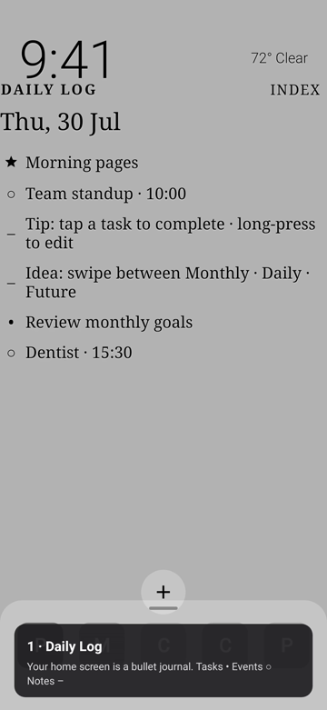

# Bullet Launcher

A minimal Android home-screen launcher built around a **bullet journal**. Your home screen is the Daily Log — rapid-log tasks, events, and notes, then reach apps from a bottom dock.

[Download the debug APK](https://github.com/basicBrogrammer/bullet-launcher/raw/master/artifacts/bullet-launcher-debug.apk) · package `app.bulletlauncher.debug`

## Guided walkthrough

First launch seeds sample tasks, events, and tip notes so you can explore the journal immediately. Watch the tour:

[](https://github.com/basicBrogrammer/bullet-launcher/raw/master/artifacts/media/guided-walkthrough.mp4)

<video src="https://github.com/basicBrogrammer/bullet-launcher/raw/master/artifacts/media/guided-walkthrough.mp4" controls width="360" poster="artifacts/media/guided-walkthrough-poster.png" playsinline>
  <a href="https://github.com/basicBrogrammer/bullet-launcher/raw/master/artifacts/media/guided-walkthrough.mp4">Download / play the guided walkthrough</a>
</video>

## How it works

### Bullet journal home

Home is a horizontal pager: **Monthly · Daily · Future**.

| Symbol | Type | Behavior |
|--------|------|----------|
| `•` | Task | Tap to complete · long-press to edit |
| `○` | Event | Optional time · two-way calendar sync |
| `–` | Note | Thoughts and tips |
| `★` | Priority | Signifier next to important tasks |

- **FAB `+`** adds a bullet (type, schedule, tags).
- **Long-press** opens Edit entry (Save / Delete) — never deletes immediately.
- **Index** lists Unscheduled and tag collections (e.g. Personal, Work).

### Home apps & gestures

- Bottom dock: **5 columns × up to 3 rows** (collapsed = 1 row). Slot 13 is the **app drawer** button.
- **Swipe up** expands the home apps sheet only (never opens the full drawer).
- **Full app drawer** opens only from the drawer button (overlay so dock stays droppable).
- **Swipe down** closes the drawer, or collapses the sheet; notification/search swipe-down only when both are closed.
- **Back** closes the drawer; **Home** closes the drawer and returns to the Daily log.

### Calendar sync

Event bullets can sync both ways with the device / Google Calendar. Choose which calendars appear in Settings → Calendars to sync.

## Install

1. [Download the debug APK](https://github.com/basicBrogrammer/bullet-launcher/raw/master/artifacts/bullet-launcher-debug.apk)
2. Allow installs from unknown sources if prompted
3. Install, then set **Bullet Launcher** as the default Home app when Android asks

Debug builds use package `app.bulletlauncher.debug` and are signed with the Android debug keystore (sideload only).

## Build

```bash
./gradlew assembleDebug
# APK → app/build/outputs/apk/debug/app-debug.apk
```

Visual demo screenshots (no emulator): `./gradlew :app:renderDemoScreens`

## Credits

Bullet Launcher started from **[Olauncher](https://github.com/tanujnotes/Olauncher)** by [tanujnotes](https://github.com/tanujnotes) — a minimal, ad-free Android launcher. We’re reshaping that foundation into a bullet-journal home screen while keeping the same spirit of simplicity.

## License

[GNU GPLv3](LICENSE)
